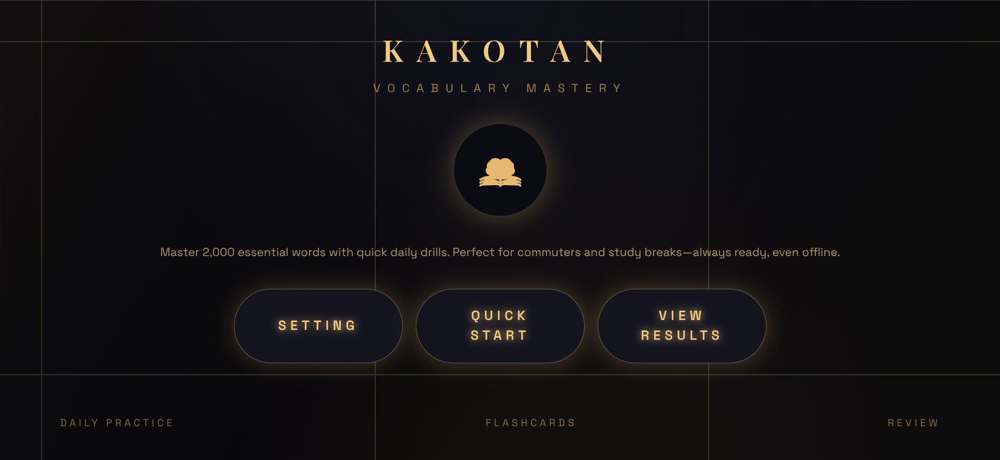
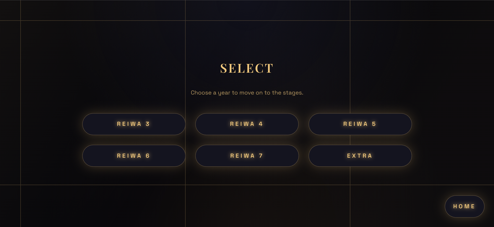
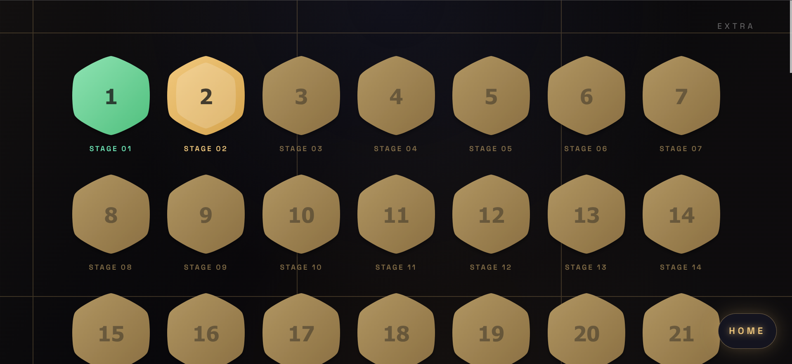
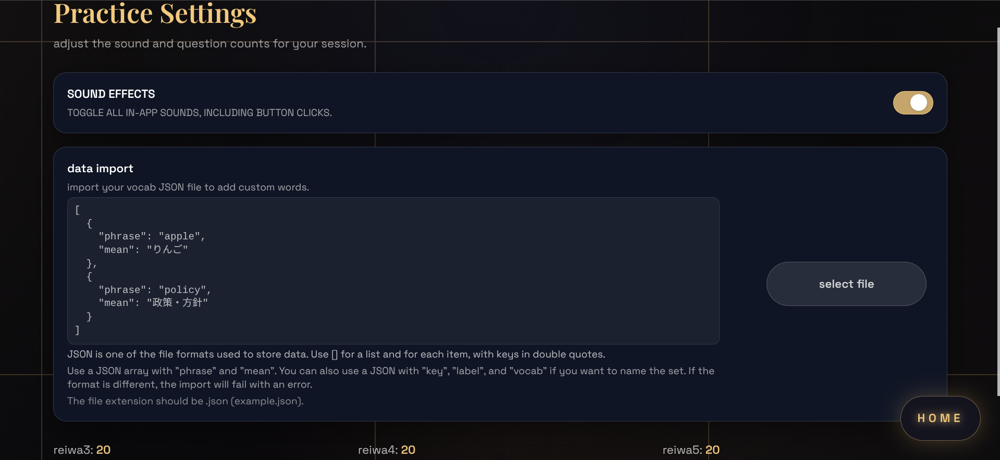
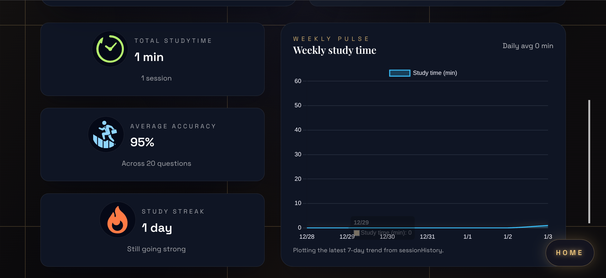
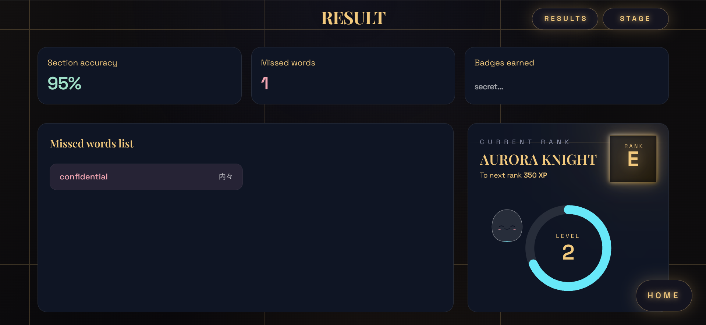

# カコタン

このアプリは令和３~7年度までの共通テスト英語リーディングから特に頻出な英単語を、日本語訳４択式で学習できる英単語アプリです。

アプリURL: https://bst-1900.pages.dev/

<p align="center">
  
</p>

## 主な機能

- 年度ごとの英単語テスト（令和 3〜7 年想定）
- 出題数をユーザー設定から調整できるテスト生成
- 正答数・スコアの表示と簡易的な結果画面
- ローカルストレージを使った出題数設定の保存

## 技術スタック

- フロントエンド: React 19, TypeScript, Vite
- UI: Tailwind CSS, Radix UI
- グラフ表示: Chart.js, react-chartjs-2
- テスト: Vitest + React Testing Library

## 動作環境

- Node.js: 20.19 以上（推奨は 22 系）
- npm: 8 以上

## セットアップ

```bash
# 依存関係のインストール（root で実行）
npm install

# 開発サーバーを起動（http://localhost:5173）
npm run dev

# 本番ビルド
npm run build

# Lint チェック
npm run lint
```

## ディレクトリ構成

- `main/` … React + Vite のフロントエンド
  - `src/pages/` … 画面コンポーネント（テスト/結果/ステージ/設定）
  - `src/components/` … 共通 UI（ボタン/モーダル/レイアウト）
  - `src/hooks/` … 画面横断の共通ロジック
  - `src/data/` … 単語データと年度レジストリ（追加の入口）
  - `src/assets/vocab/` … 年度ごとの単語 JSON（実データの置き場）
  - `src/features/` … ドメインロジック（スコア計算/ステージ計算など）
  - `test/` … テストコード一式（src から分離して集中管理）
- `phrase/` … 本番用の語彙データ
- `data/` … 生データと語彙生成のための元資料
- `docs/` … デザインやスクリーンショットなどの資料

## 年度の単語データを追加する方法

単語データは **`main/src/data/yearRegistry.ts`** に登録すると自動で反映されます。  
このファイルに 1 行追加するだけで、メニュー・テスト・ステージ画面に新しい年度が出ます。

- パス: [`main/src/data/yearRegistry.ts`](main/src/data/yearRegistry.ts)

### 追加手順（かんたん）

1. 年度の単語 JSON を `main/src/assets/vocab/` に置く
2. `yearRegistry.ts` の `yearRegistry` 配列に年度の設定を追加する

## 単語データの追加

新しい年度の単語を追加したいときは、**JSONの配置** → **yearRegistryへの登録** の順で進めます。

- 登録先: [`main/src/data/yearRegistry.ts`](main/src/data/yearRegistry.ts)

### 手順1: JSONを置く

年度ごとの単語JSONはここに置きます。

- `main/src/assets/vocab/`

例:

```
main/src/assets/vocab/reiwa8.unigram.json
```

### 手順2: yearRegistry.tsで読み込む

`yearRegistry.ts` の先頭でJSONを読み込みます。

```ts
import reiwa8Vocab from "../assets/vocab/reiwa8.unigram.json";
```

### 手順3: yearRegistryにオブジェクトを追加する

`yearRegistry` 配列に新しい年度の設定を追加します。  
ここで **key/label/sectionLabel/vocab/theme/defaultQuestionCount** を登録します。

```ts
{
  key: "reiwa8",
  label: "Reiwa 8",
  sectionLabel: "令和8年",
  vocab: reiwa8Vocab as VocabEntry[],
  theme: {
    accent: "#f2c97d",
    accentSoft: "#ffe6b1",
    accentGlow: "rgba(242, 201, 125, 0.35)",
  },
  defaultQuestionCount: 20,
},
```

### 登録後に自動で反映されるもの

- メニューの年度一覧
- ステージ画面の年度カラー
- テスト画面の年度セクション

### yearRegistry のプロパティ説明

`yearRegistry` は「年度ごとの設定辞書」です。  
ここを 1 箇所だけ更新すれば、画面・テスト・ステージの年度情報が自動で同期されます。

- `key`  
  年度のユニークID。URLやlocalStorageのキー計算に使われるため変更すると既存データと互換が切れます。  
  例: `"reiwa3"`
- `label`  
  画面表示用の英語ラベル。メニューやテスト画面の見出しに使います。  
  例: `"Reiwa 3"`
- `sectionLabel`  
  設定画面などで使う日本語の見出し。  
  例: `"令和3年"`
- `vocab`  
  単語JSONの配列。`main/src/assets/vocab/` の import をここに割り当てます。  
  例: `reiwa3Vocab as VocabEntry[]`
- `theme`  
  年度ごとのUIカラー。ステージタイルやバッジの色味に反映されます。  
  デザインを崩さないように3色セットで持ちます。
  - `accent` … メイン色
  - `accentSoft` … うすい色
  - `accentGlow` … ふわっと光る色
- `defaultQuestionCount`  
  ユーザー設定が無い場合のデフォルト出題数。  
  `useAllYearVocab` と設定画面の初期値で参照します。

## テスト

フロントエンドのテストは Vitest で実行できます。

```bash
npm --prefix main run test -- run
```

## スクリーンショット

### ホーム / メニュー

<p align="center">
  
  
</p>

### ステージ / 設定

<p align="center">
  
  
</p>

### 結果画面

<p align="center">
  
  
  
</p>

## デモ動画

### テスト画面デモ

<p align="center">
  <video src="docs/test.mp4" width="480" controls>
    Your browser does not support the video tag.
  </video>
</p>


## コントリビュート

- Issue や Pull Request は日本語で歓迎です。
- コミットメッセージはこのリポジトリに合わせて、簡潔な日本語で書いてください。
- PR にはできればスクリーンショットと、`npm run lint` / `npm --prefix main run test -- run` の実行結果を添えてもらえると助かります。

## ライセンス

### All Rights Reserved

本リポジトリの配布・転載は禁止の詳細は `LICENSE` を参照してください。
