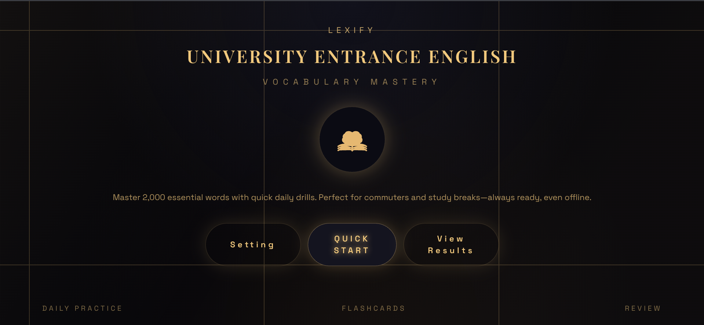
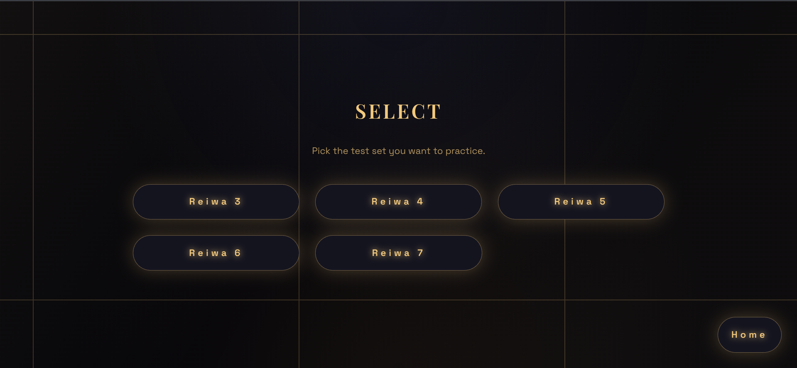
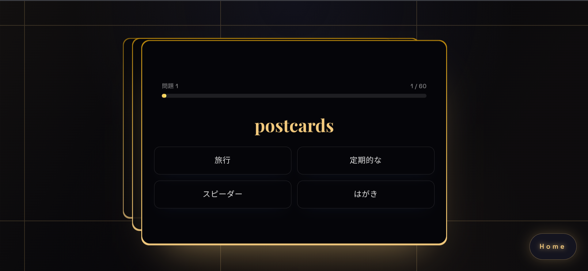

# カコタン

このアプリは令和３~7年度までの共通テスト英語リーディングから特に頻出な英単語を、日本語訳４択式で学習できる英単語アプリです。

アプリURL: https://bst-1900.pages.dev/

<p align="center">
  
</p>

## 主な機能

- 年度ごとの英単語テスト（令和 3〜7 年想定）
- 出題数をユーザー設定から調整できるテスト生成
- 正答数・スコアの表示と簡易的な結果画面
- ローカルストレージを使った出題数設定の保存

## 技術スタック

- フロントエンド: React 19, TypeScript, Vite
- UI: Tailwind CSS, Radix UI
- グラフ表示: Chart.js, react-chartjs-2
- テスト: Vitest + React Testing Library

## 動作環境

- Node.js: 20.19 以上（推奨は 22 系）
- npm: 8 以上

## セットアップ

```bash
# 依存関係のインストール（root で実行）
npm install

# 開発サーバーを起動（http://localhost:5173）
npm run dev

# 本番ビルド
npm run build

# Lint チェック
npm run lint
```

## ディレクトリ構成

- `main/` … React + Vite のフロントエンド
  - `src/pages/` … 画面コンポーネント（テストページや設定画面など）
  - `src/components/` … 共通 UI コンポーネント
  - `src/hooks/` … 共通ロジック（単語ロード用のカスタムフックなど）
  - `src/data/` … 単語データと年度レジストリ
  - `src/assets/vocab/` … 年度ごとの単語 JSON
  - `test/` … テストコード一式
- `phrase/` … 本番用の語彙データ
- `data/` … 生データと語彙生成のための元資料
- `docs/` … デザインやスクリーンショットなどの資料

## 年度の単語データを追加する方法

単語データは **`main/src/data/yearRegistry.ts`** に登録すると自動で反映されます。  
このファイルに 1 行追加するだけで、メニュー・テスト・ステージ画面に新しい年度が出ます。

- パス: [`main/src/data/yearRegistry.ts`](main/src/data/yearRegistry.ts)

### 追加手順（かんたん）

1. 年度の単語 JSON を `main/src/assets/vocab/` に置く
2. `yearRegistry.ts` の `yearRegistry` 配列に年度の設定を追加する

### yearRegistry のプロパティ説明（小学生向け）

`yearRegistry` は「年度ごとの箱の一覧」です。  
1つの箱に「年度名・色・問題数・単語の中身」が全部入っています。

- `key`  
  箱の番号。機械が探すときの名前。例: `"reiwa3"`
- `label`  
  画面に出す英語の名前。例: `"Reiwa 3"`
- `sectionLabel`  
  日本語の名前。設定画面の見出しに使う。例: `"令和3年"`
- `vocab`  
  単語の中身。ここに JSON のデータを入れる。
- `theme`  
  年度の色セット。タイルやバッジの色になる。
  - `accent` … メイン色
  - `accentSoft` … うすい色
  - `accentGlow` … ふわっと光る色
- `defaultQuestionCount`  
  1回のテストで出す問題数の最初の値。

## テスト

フロントエンドのテストは Vitest で実行できます。

```bash
npm --prefix main run test -- run
```

## スクリーンショット

### ホーム / メニュー

<p align="center">
  
</p>

<p align="center">
  
</p>

### テスト画面

<p align="center">
  
</p>

## デモ動画

### テスト画面デモ

<p align="center">
  <video src="docs/test.mp4" width="480" controls>
    Your browser does not support the video tag.
  </video>
</p>

## コントリビュート

- Issue や Pull Request は日本語で歓迎です。
- コミットメッセージはこのリポジトリに合わせて、簡潔な日本語で書いてください。
- PR にはできればスクリーンショットと、`npm run lint` / `npm --prefix main run test -- run` の実行結果を添えてもらえると助かります。

## ライセンス

### Apache-2.0
